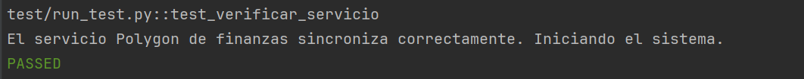
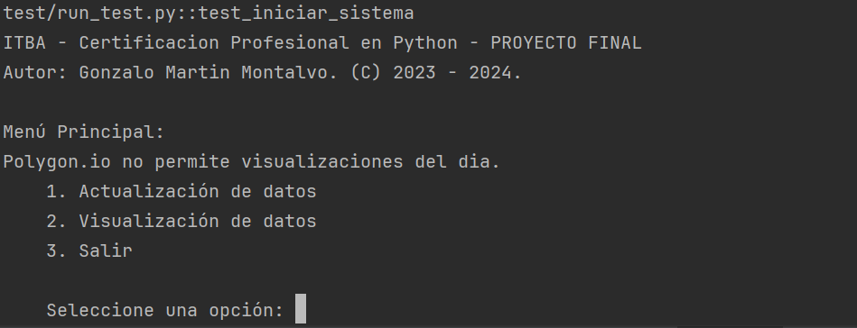
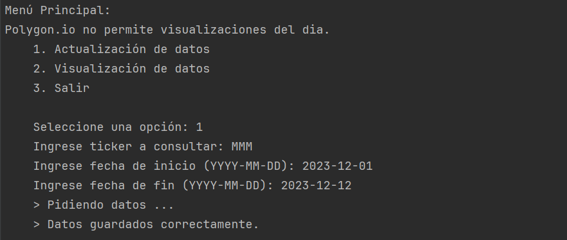
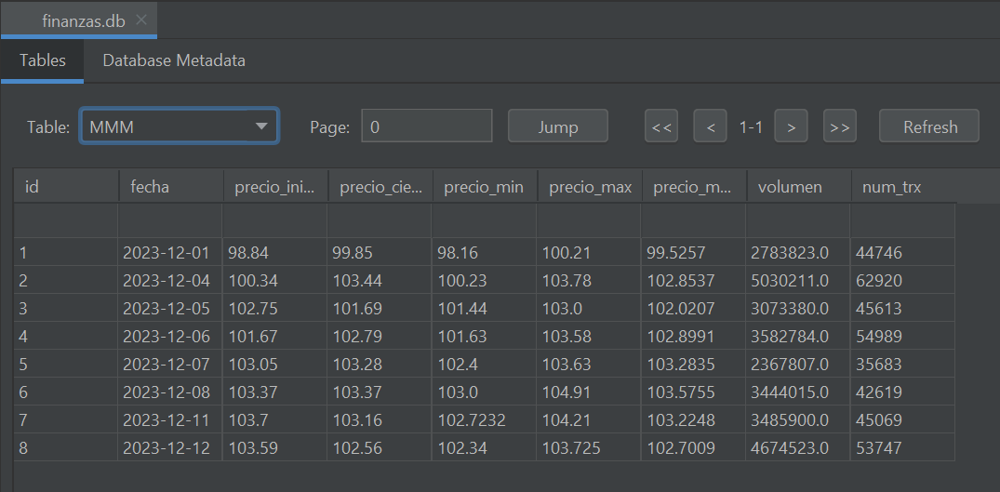
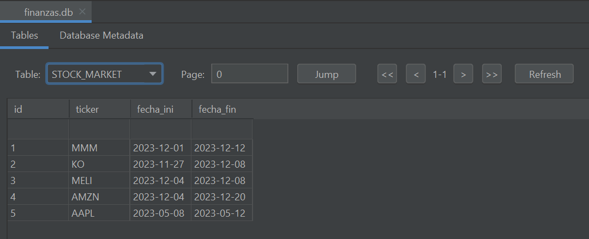
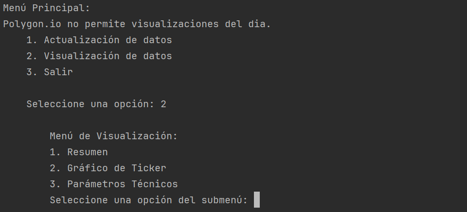
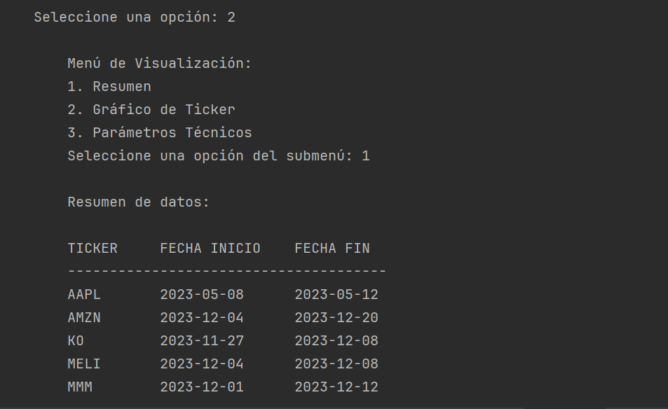
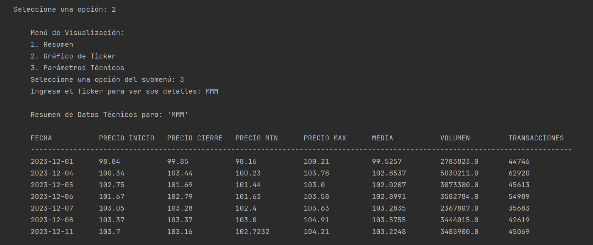

# Documentación: Informe de Funcionalidad y Diseño

## Certificación Profesional en Python - Proyecto Final

### Proyecto: Sistema de Finanzas con API de Polygon.io

### Tabla de Contenidos:

1. [Objetivo del Proyecto](#objetivo-del-proyecto)
2. [Estructura de Recursos](#estructura-de-recursos)
   - [Carpetas y Archivos](#carpetas-y-archivos)
   - [Estructura de la Base de Datos](#estructura-de-la-base-de-datos)
   - [API Elegida para el Proyecto](#api-elegida-para-el-proyecto)
3. [Uso de Pytest](#uso-de-pytest)
4. [Uso y Funcionamiento](#uso-y-funcionamiento)
   - [Inicio del Sistema](#inicio-del-sistema)
   - [1. Actualización de Datos](#1-actualización-de-datos)
   - [2. Visualización de Datos](#2-visualización-de-datos)
   - [3. Salir](#3-salir)
5. [Manual de Usuario](#manual-de-usuario)
   - [Clonar el Proyecto](#clonar-el-proyecto)
   - [Requisitos Previos](#requisitos-previos)
   - [Iniciar el Sistema](#iniciar-el-sistema)
   - [Actualización de Datos](#actualización-de-datos)
   - [Visualización de Datos](#visualización-de-datos)
   - [Salir del Sistema](#salir-del-sistema)
6. [Conclusión](#conclusión)
7. [Autor y Desarrollador](#autor-y-desarrollador)


### Objetivo del Proyecto:

El proyecto tiene como objetivo principal la recopilación y gestión de datos financieros a través de la API de Polygon.io. Permite actualizar y almacenar información sobre diferentes tickers, así como visualizar resúmenes y gráficos asociados a estos instrumentos financieros.

Los datos persistirán en una base de datos portable usando SQLite.

### Estructura de Recursos:

#### Carpetas y Archivos:

El proyecto se organiza en cinco carpetas principales:

```
Root                     Raíz del sistema.
├───db                   Base de datos SQLite.
├───docs                 Documentación del sistema.
│   └───assets           Imágenes y recursos.
├───lib                  Módulo de funciones.
├───src                  Script principal.
├───test                 Pruebas unitarias.
.gitignore               Archivo de configuración de Git.
conftest.py              Archivo de configuración de pytest.
License                  Licencia del proyecto.
pytest.ini               Archivo de configuración de pytest.
README.md                Archivo de presentación del proyecto.
requirements.txt         Lista de bibliotecas requeridas.
```

 1. **`db`**: Contiene la base de datos `finanzas.db` que almacena los datos financieros de los tickers. La base de datos se inicializa con una tabla `STOCK_MARKET` que almacena los datos de los tickers, incluyendo su símbolo, nombre, fecha de inicio y fin, precios, volumen y otros parámetros técnicos.


 2. **`docs`**: Contiene el manual de usuario `documentacion.md`. Incluye la documentación de cómo usar el sistema.
    - **`assets`**: Contiene imágenes y recursos para la documentación.


 3. **`lib`**: Contiene el módulo `funciones.py` que incluye las funciones relacionadas con la manipulación de la base de datos SQLite, la interacción con la API de Polygon.io y la gestión de claves de seguridad.


 4. **`src`**: Contiene el script principal `proyecto.py`, responsable de la interfaz de usuario y la interacción con las funciones del módulo `lib`. Aquí se implementan funciones para actualizar datos, mostrar resúmenes, graficar tickers y obtener parámetros técnicos.


 5. **`test`**: Contiene el script `run_test.py` con pruebas unitarias escritas usando pytest. Estas pruebas aseguran el correcto funcionamiento de funciones clave, como la verificación del servicio de Polygon.io y la inicialización del sistema de finanzas.


 - **`Root`**: Contiene los archivos:
   - `.gitignore`: Archivo de configuración de Git, excluyendo archivos y carpetas específicos.
   - `conftest.py`: Archivo de configuración de pytest.
   - `License`: Licencia del proyecto.
   - `pytest.ini`: Archivo de configuración de pytest.
   - `README.md`: Archivo de presentación del proyecto.
   - `requirements.txt`: Lista de bibliotecas requeridas para el proyecto.

Elegí esta estructura de archivos porque me pareció más legible y se acomoda bien a la forma que tengo de encarar un proyecto de APIs.

#### Estructura de la Base de Datos:

La base de datos `finanzas.db` se inicializa con una tabla `STOCK_MARKET` que almacena los datos de los tickers, incluyendo su símbolo, nombre, fecha de inicio y fin, precios, volumen y otros parámetros técnicos.
A su vez, la base va creando en tiempo de ejecución nuevas tablas para cada ticker que se actualiza, en el caso de que no exista.

Su estructura es la siguiente:
````commandline
TICKER
├───id              INTEGER PRIMARY KEY AUTOINCREMENT
├───fecha           TEXT UNIQUE
├───precio_inicio   REAL
├───precio_cierre   REAL
├───precio_min      REAL
├───precio_max      REAL
├───precio_media    REAL
├───volumen         REAL
├───num_trx         INTEGER
````

````commandline
STOCK_MARKET
├───id              INTEGER PRIMARY KEY AUTOINCREMENT
├───ticker          TEXT UNIQUE
├───fecha_ini       TEXT
├───fecha_fin       TEXT
````


#### API Elegida para el Proyecto:
La API de Polygon.io es una API de datos financieros que proporciona información sobre el mercado de valores, incluyendo datos de tickers, precios, volumen, parámetros técnicos y otros datos relevantes.
Por cuestiones de licenciamiento, la API de Polygon.io solo permite ver datos históricos hasta el día anterior a la consulta. Para ver el día actual se necesita una actualización en su licencia (pricing).
Para más info, la web de Polygon.io es [Polygon.io](https://polygon.io/).

### Uso de Pytest

Se usa pytest para realizar pruebas unitarias. Las pruebas están marcadas con etiquetas, como `verificar_servicio` e `iniciar_sistema`, y se enfocan en verificar la conexión con la API de Polygon.io y el correcto inicio del sistema de finanzas.



### Uso y Funcionamiento

#### Inicio del Sistema:
Al iniciarse el sistema se desplegará un menú principal con tres opciones:
`Actualización de Datos`, `Visualización de Datos` y `Salir`.




#### 1. Actualización de Datos:

Al seleccionar la opción `1` en el menú principal e ingresar un ticker, fecha de inicio y fecha de fin, el sistema solicitará datos a la API de Polygon.io. Estos datos se almacenan en la base de datos SQLite, evitando duplicados y actualizando las fechas de inicio y fin del ticker en la tabla `STOCK_MARKET`.

Vista Menú Actualización de Datos:


Vista de los Datos Actualizados del Ticker:


Vista de la actualización de datos en la tabla de Tickers `STOCK_MARKET` (lugar donde se guardan todos los tickers a modo de histórico):


#### 2. Visualización de Datos:

En la opción `2`, se accede a un submenú que permite:



- **`Resumen` (Subopción 1):** Muestra un resumen de todos los tickers almacenados en la base de datos.



- **`Gráfico de Ticker` (Subopción 2):** Permite visualizar gráficos de velas para un ticker específico.


- **`Parámetros Técnicos` (Subopción 3):** Muestra parámetros técnicos para un ticker, como precios, volumen y número de transacciones, entre otros datos.


#### 3. Salir:

La opción `3` finaliza la ejecución del programa.


### Manual de Usuario

#### Clonar el Proyecto

- Debes tener GIT instalado en el equipo con lo necesario para poder clonar el proyecto.

- Clonar el repositorio: `git clone https://github.com/GonzaloMartin/ITBA-Proyecto-Final-Certificacion-Profesional-Python.git`

#### Requisitos Previos

- Python 3.x instalado.

- Bibliotecas requeridas: `pip install -r requirements.txt`


#### Iniciar el Sistema

1. Ejecute el script principal: `pytest -v -s -x`
2. Se mostrará el menú principal.
3. Elija una opción (1, 2, o 3) según la operación deseada.


#### Actualización de Datos

1. Seleccione la opción `1`.
2. Ingrese el ticker, la fecha de inicio `(YYYY-MM-DD)` y la fecha de fin `(YYYY-MM-DD)` cuando se le solicite.
3. Espere a que el sistema obtenga y almacene los datos.
4. Los datos se almacenarán en la base de datos SQLite y se mostrará un mensaje de confirmación.


#### Visualización de Datos

1. Seleccione la opción `2` y luego elija una subopción (1, 2 o 3) según la visualización deseada.
2. Siga las instrucciones en pantalla para completar la operación.

**Resumen:** Muestra un resumen de todos los tickers almacenados en la base de datos.

**Gráfico de Ticker:** Permite visualizar gráficos de velas para un ticker específico.

**Parámetros Técnicos:** Muestra parámetros técnicos para un ticker, como precios, volume y número de transacciones, entre otros datos.


#### Salir del Sistema

1. Seleccione la opción `3`.
2. El programa finalizará su ejecución.


### Conclusión

El proyecto ofrece una interfaz sencilla de consola para actualizar y visualizar datos financieros, proporcionando una herramienta útil para quienes se avoquen a las finanzas y análisis o seguimiento del mercado de capitales.

La API elegida fue Polygon.io. La misma solo es consultable a excepción del día actual, dado que para ver el día actual se necesita una actualizacíon en su licencia (pricing).

La estructura modular y las pruebas unitarias aseguran la confiabilidad y mantenibilidad del sistema.


### Autor y Desarrollador

- Gonzalo Montalvo | [@GonzaloMartin](https://github.com/GonzaloMartin).
